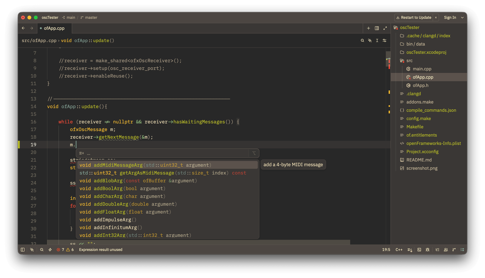
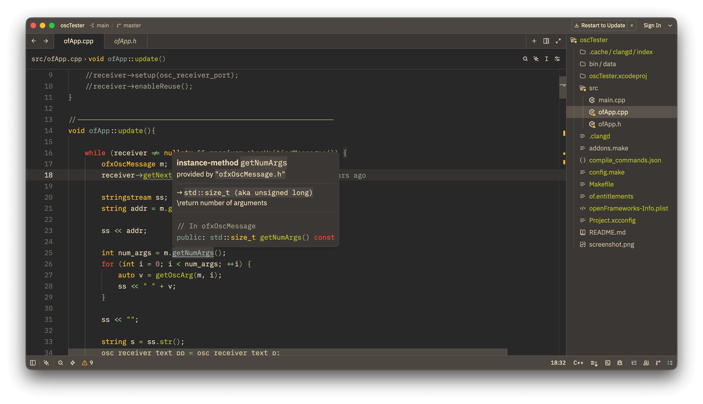

# openFrameworks Zed Project Generator (for static analysis only)

[](https://crates.io/crates/of-zed-project-generator-rs)
[](https://docs.rs/of-zed-project-generator-rs)
[](LICENSE)

Code suggestion            |  Static analysis (and AI etc...)
:-------------------------:|:-------------------------:
  |  

***NOTE***: This tool is NOT official one of openFrameworks.

openFrameworks project generator for [Zed](https://zed.dev/).

(only for static code analysis like syntax-highlighting, definition jumping or clangd completions. Not for building or debug.)

## Usage

NOTE: You first need to generate project using default projectGenerator.

```bash
$ cd /path/to/your/openFrameworks/apps/myApps
$ cd your_project
$ of-zed-project-generator-rs .
```

## Install

```bash
$ cargo install of-zed-project-generator-rs
```

or nightly (directly from github):

```bash
$ git clone https://github.com/funatsufumiya/of-zed-project-generator-rs
$ cd of-zed-project-generator-rs
$ cargo install --path .
```

## Uninstall

```bash
$ cargo uninstall of-zed-project-generator-rs
```

## Limitations

- This tool loads some part of each `addon_config.mk` incompletedly (and not load `config.make`). If you need more, please modify `compile_commands.json` / `.clangd` manually after running this script (or make PR).
- This tool exports environment-dependent settings. So you should not include `compile_commands.json` or `.clangd` in your git repository.

## License

WTFPL or 0BSD
